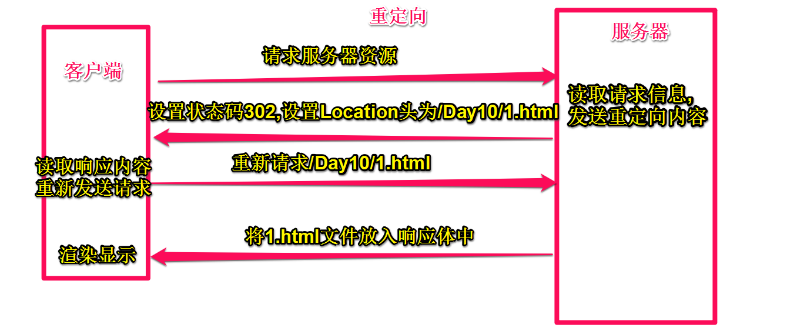

# HttpServlet
在实际的开发过程中,我们不会去创建一个类实现`Servlet`接口,我们会直接创建一个类去继承`HttpServlet`,这个是Tomcat提供的一个类,并且实现了`Servlet`接口
```java
public class Myservlet extends HttpServlet {
	private static final long serialVersionUID = 1L;
  protected void doGet(HttpServletRequest request, HttpServletResponse response) throws ServletException, IOException {
    response.getWriter().append("Served at: ").append(request.getContextPath());
  }
  protected void doPost(HttpServletRequest request, HttpServletResponse response) throws ServletException, IOException {
    doGet(request, response);
  }
}
```

## ServletContext对象

`ServletContext`代表是一个web应用的环境(上下文)对象,`ServletContext`对象 内部封装是该web应用的信息一个web应用只有一个`ServletContext`对象

- ServletContext的生命周期  
  - 创建:当前的web应用创建的时候,一般web应用会随着服务器的启动而创建(或者发布的时候)
  - 销毁:web应用被卸载(服务器关闭,或者删除当前的web应用)
- 得到ServletContext对象
  - 在doGet或者doPost方法中调用 `this.getServletContext(); `
- ServletContext是一个域对象,因为它随着服务器的启动而创建,服务器的关闭而销毁,所以存放在`ServletContext`中的数据是整个web应用所共享的
  - 向ServletContext域中放入数据 `setAtrribute(String name,Object obj);`
  - 从ServletContext域中获取数据 `getAttribute(String name);`
  - 从ServletContext域中删除数据 `removeAttribute(String name);`


## HttpServletResponse
`service`方法中的`response`的类型是`ServletResponse`,而`doGet/doPost`方法的`response`的类型是`HttpServletResponse`,
`HttpServletResponse`是`ServletResponse`的子接口

### response运行流程
tomcat内核发送一个空内容的response对象,供我们去将需要的内容放入

### response设置响应行
如果使用response设置了状态码,那么tomcat就不会再去设置状态码了
```java
response.setStatus(302);
```
### response设置响应头
- 设置状态码302
- 设置头信息
```java
response.setStatus(302);
response.setHeader("Location", "http://baidu.com");
```
以上功能能够实现重定向,原理就是当客户端收到响应后,响应头信息中含有 `Location`是 `/WebTest/index.html` ,所以客户端就会自动跳转,当然我们如果要去实现重定向,可以直接使用封装好的方法,但是其内部实现还是上述内容.

## response重定向
重定向路径必须写绝对路径格式: `/web应用/`
```java
response.sendRedirect("/WebTest/index.html");
```

定时重定向
```java
response.setStatus(302);
response.setHeader("refresh", "3;url=http://baidu.com");
```



### 重定向特点
- 重定向过程是客户端收到消息后,再做的请求,所以浏览器的地址会发生改变
- 服务器收到的请求是两次请求

### response设置响应体

通过response可以将客户端需要的数据放入响应体中,其过程是先将返回的信息放在response的缓冲区中,然后由tomcat读取缓冲区的内容,封装成http的响应内容发送给客户端
```java
//将数据写入response缓冲区
response.getWriter().write("大家好");
```
- `response.getWriter()`获取- `response`缓冲区流
- 调用`write`方法向缓冲区中输入内容
- tomcat会自动向缓冲区中获取数据封装成http响应,将数据放在响应体中
### 解决中文乱码
- Tomcat默认编码格式为iso8859-1,所以需要改编码格式为utf-8
- 但是浏览器可能解码的时候不是使用UTF­8,
- 所以我们需要设置一个响应头,通知客户端使用响应的码表进行解码

- 添加了响应头Tomcat会自动为我们将response缓冲区的编码表设置为utf­8, 不需要再另外设置编码
```java
response.setHeader("Content-Type", "text/html;charset=UTF-8");
```
- 建议以下方式,更简便
```java
response.setContentType("text/html;charset=UTF-8");
```

## HttpServletRequest
客户端发送过来的请求通过tomcat内核进行提取,然后将数据封装`HttpServletRequest`对象中,在调用servlet的service方法的时候将此对象作为参数传递过来,HttpServlet在service内部调用doGet和doPost方法将此对象作为参数传递过来.

- 获取请求方式
```java
String method = request.getMethod();
System.out.println(method); //GET
```
- 获取uri和url路径
- `uri`:统一资源标识符,通过request获取uri获取的是请求路径中web应用后的字符串不包含QueryString
- `url`:同一资源定位符,通过request获取的url是带有协议名称应用名称端口号的完全路径
```java
System.out.println(request.getRequestURI()); ///Day15/myrequest
System.out.println(request.getRequestURL());  //http://localhost:8080/Day15/myrequest
```
- 获取web应用的名称(也就是绝对路径)
```java
System.out.println(request.getContextPath()); // /Day15 前面有/ 后面没有/
```
- 重定向
```java
//重定向会出现硬编码的问题,采用下面的模式
response.sendRedirect("/Day15/a.html");
response.sendRedirect(request.getContextPath()+"/1.html");
```
- 获取get请求表单数据,此方法不常用,先通过&将符号拆分,再通过=拆分 
```java
System.out.println(request.getQueryString());
```
- 不太常用
```java
//host名称
System.out.println(request.getServerName());
//端口号
System.out.println(request.getServerPort());
//servlet请求路径(url-pattern)
System.out.println(request.getServletPath());
//请求的协议
System.out.println(request.getScheme());
```

### 获取请求头的内容

- 获取指定头的数据
```java
//获取系统与浏览器信息
System.out.println(request.getHeader("User-Agent"));
//获取referer,常用于防盗链
System.out.println(request.getHeader("referer"));
```

#### 获取请求体的内容

- 获取请求的具体表单内容, get post都适用, 参数为name值, 返回值为value值
```java
System.out.println(request.getParameter("name"));
System.out.println(request.getParameter("password"));
```
- 获取提交表单数据中一个name多个value数据
```java
String[] values = request.getParameterValues("hobby");
System.out.println(Arrays.toString(values));
```

- 获取提交表单所有数据, 数据格式是map格式,key指的是表单中的name属性,value是字符串数组,数组中存放的是对应的value属性
```java
Map<String, String[]> map = request.getParameterMap();
Set<Entry<String, String[]>> entrySet = map.entrySet();
for (Entry<String, String[]> entry : entrySet) {
	System.out.println(entry.getKey());
	System.out.println(Arrays.toString(entry.getValue()));
}
```

### 请求乱码处理
对于表单提交,由于页面的编码格式utf­8,但在服务器端,将数据提取封装到request对象的时候采用的是iso8859­1,所以出现乱码

- post提交
```java
request.setCharacterEncoding("UTF-8");
```
- get请求
```java
String parameter = request.getParameter("username");
parameter = new String(parameter.getBytes("iso8859-1"),"utf-8");
```

## 内部转发
客户端向服务器发送请求,服务器收到这个请求以后,可以在内部进行一个转发功能,也就是在不告知客户端的情况下进行请求的转发

- 获取转发器
- 通过转发器进行请求转发 
- 可以通过内部转发访问WEB-INF中的内容

```java
RequestDispatcher dispatcher = request.getRequestDispatcher("/fail.html");
dispatcher.forward(request, response);
//一般写下面连写格式
request.getRequestDispatcher("/login").forward(request, response);
```

- 内部转发客户端浏览器的地址不会发生改变,因为自始至终客户端只发送一个请求
- 通过内部转发路径一定要注意,因为操作过程是在服务器内部进行操作的,所以地址就不能够是客户端地址,而应该是服务器端地址,路径不能再写web应用的名称,/就web应用的根目录
- 通过内部转发,两个servlet或者两个界面的接收到的request内的内容是相同的
- 因为内部转发是在服务器内部做的处理,所以内部转发是可以直接访问到1WEB­-INF`下的内容的

### 内部转发和重定向的区别
- 重定向两次请求,内部转发一次请求
- 重定向浏览器地址会发生改变,内部转发地址不变
- 重定向不能访问`WEB-INF`内容,内部转发可以访问
- 重定向路径相对于tomcat服务器,内部转发路径相对于web应用
- 重定向使用response对象调用,内部转发使用request对象调用

## 域对象
`request`对象也是一个域对象,所以也是可以存放数据的
### 数据的写入,读取,删除

- 向request域中放入数据 `setAtrribute(Stringname,Object obj);`
- 从request域中获取数据 `getAttribute(String name);`
- 从request域中删除数据 `removeAttribute(Stringname);`

### request域生命周期

- 创建:一次请求访问的时候创建request
- 销毁:一次请求结束后
- 作用范围:只在一次请求中

### `request`和`servletContex`t区别

- 相同点  
  - 都是域对象,都能存放,读取,删除数据
- 不同点  
  - `servletContext`随着服务器的开启而开启,服务器的关闭而关闭,作用范围在整个服务器服务期间
  - `request`每一次请求tomcat都会重新创建一个新的`request`,所以`request`的作用范围只在一个请求中,如果使用内部转发机制建议使用`request`做为存储