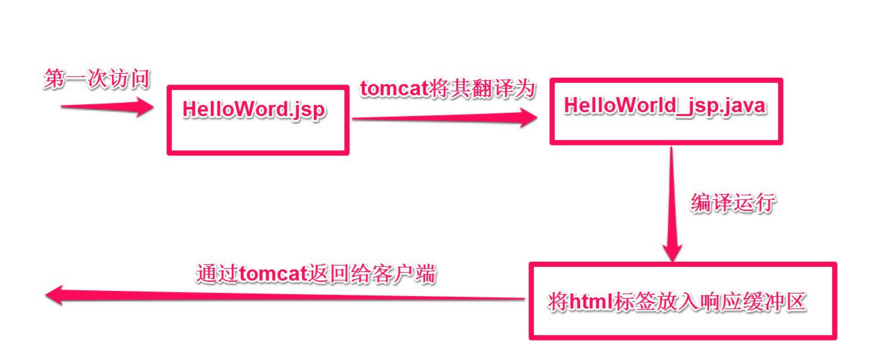

# JSP+EL+JSTL

## JSP

jsp的实质就是在html界面中嵌入java代码

### jsp脚本格式

- `<%java代码%>` 相当于写在service方法中的
- `<%=java变量或表达式>` 相当于在service内部写了`out.println`
- `<%!java代码%>` ,实质上翻译成servlet,出现在成员变量的位置
- `<!--注释内容-->` ,源代码可见,翻译后的java文件可见,最终的html文件可见
- `//单行注释`   `/*多行注释*/` 源文件可见,翻译后的文件可见,最终的html文件不可见
- `<%--注释内容--%>` 源文件可见,翻译后的servlet不可见,最终的html文件不可见

### jsp的运行原理

jsp文件在第一次被访问的时候会被解析servlet,所以jsp的实质就是一个servlet类,将内部的html标签在servlet内部使用`response.getWriter.write()`的方式进行输出


### jsp的指令

- page指令  
  - `language`:jsp脚本中可以嵌入的语言种类
  - `pageEncoding`:当前jsp文件的本身编码—内部可以包含`contentType`
  - `contentType`:`response.setContentType(text/html;charset=UTF­8)`
  - `import`:导入java的包
  - `errorPage`:当前页面出错后跳转到哪个页面
  - `isErrorPage`:当前页面是一个处理错误的页面,配置后可以获取异常信息
- include指令,是包含文件的指令 `<%@ include file="被包含的文件地址"%>`
- taglib指令,用于导入标签库, `<%@ taglib uri="标签库地址" prefix="前缀"%>`

### jsp九大内置对象
|名称 |描述|
|:-:|:-:|
|pageContext |JSP的页面容器|
|session |当前会话对象|
|application |servletContext对象|
|config |servlet配置,获取servlet信息|
|out |页面输出对象|
|page |当前servlet对象|
|request |request对象|
|response |response对象|
|exception |JSP页面所发生的异常,在错误页中才起作用|

### pageContext对象

`pageContext`对象也是一个域对象,所以也是可以存放数据的

#### 数据的写入,读取,删除

- 向pageContext域中放入数据 `setAtrribute(String name,Object obj);`
- 从pageContext域中获取数据 `getAttribute(String name);`
- 从pageContext域中删除数据 `removeAttribute(Stringname);`

这个域对象的作用范围只在当前的jsp页面中,所以我们一般不使用这个域对象存放数据

#### 指定向其他域中存取数据
- 向指定域中放入数据 `setAttribute(String name,Object obj,int scope)`
- 从指定域中获取数据 `getAttribute(String name,int scope)`
- 从指定域中删除数据 `removeAttrbute(String name,int scope)`
- 依次从四大域中获取数据
  - 依次从 `pageContext`  , `request` , `session` , `servletContext`这四大域中获取数据,找到即停止 `findAttribute(String name)`
- 通过pageContext对象获取其他8大内置对象
```java
pageContext.getRequest();
pageContext.getResponse();
```

### out对象

用于向指定页面输出语句,在JSP被翻译后的文件中看到的`out.write()` ,
 我们在jsp中使用 `<%="abc"%>` 使用的都是这个out对象,将数据写入out缓冲区,然后再从out缓冲区刷入response缓冲区

### exception对象

如果当前页面是一个errorpage,就是在page指令的属性中配置
`isErrorPage=true`,通过这个对象可以获取异常信息 `<%=exception.getLocalizedMessage() %>`

## EL表达式
EL（Express Lanuage）表达式可以嵌入在jsp页面内部，其目的在于简化从域中获取数据的操作

- EL就代表jsp中的`out.println()`,也就是jsp的标签`<%= %>`, 可以直接输出`${'哈哈' }`

### EL的11大内置对象
|分类 |名称 |描述
|:-:|:-:|:-:|
|作用域 |pageScope |page作用域
|作用域 |requestScope |request作用域
|作用域 |sessionScope |session作用域
|作用域 |applicationScope |application作用域
|请求参数 |param |获得一个参数
|请求参数 |paramValues |获得一组参数
|请求头 |header |获得一个请求头
|请求头 |headerValues |获得一组请求头
|jsp上下文对象 |pageContext |jsp的内置对象pageContext
|全局初始化参数 |initParam |读取配置文件
|cookie |cookie |获取请求头中的cookie

- 请求参数
  - `${param.username}` 相当于request.getParameter("username")`
  - `${paramValues.hobby}` 相当于`request.getParameterValues("hobby")`
  - `${paramValues.hobby[0]}` 相当于获取数组的第 0 个元素
  -  对于EL表达式，如果没有获取到数据，就会不输出，不会报错 
- 请求头(了解)
  - `${header.accept}` 相当于 `request.getHeader("accept")` 
  - 如果有连接符号需要写成 `${header['accept-Encoding'] }`, 因为会把连接符号当作减号
  - `${headerValues['accept-Encoding']}` 相当于`request.getHeaders("accept-Encoding")`
  - `${headerValues['accept-Encoding'][0] }` 相当于获取数组的第 0 个元素
- 全局初始化参数(了解)
  - `${initParam.name } `获取web.xml中的配置信息
  ```xml
  <context-param>
    <param-name>name</param-name>
    <param-value>haha</param-value>
  </context-param>
  ```
-读取cookie
  - 底层使用了 `request.getCookies()` ,然后进行遍历,存放到 `Map<name,Object>`
  ```java
  Cookie[] ck = request.getCookies();
  //cookie有一个name属性和value属性
  map(name属性，cookie对象)
  ```
  ```java
  ${cookie }
  ${cookie['JSESSIONID'] }
  ${cookie['JSESSIONID'].name }// JSESSIONID 
  ${cookie['JSESSIONID'].value }//JSESSIONID的值 
  ```

### 从域中获取值

- `pageScope `:能获取 `pageContext` 域中的数据
- `requestScope` :能获取 `request` 域中的数据` ${requestScope.key}`
- `sessionScope` :能获取 `session`域中的数据 `${sessionScope.key }`
- `applicationScope` :能获取 `servletContext` 域中的数据` ${applicationScope.key }`
- 依次从四个域中查找对应的值,如果存在就停止查找 `${key}`

### 内置pageContext对象

通过el获取应用程序的名称`${pageContext.request.contextPath }`  
同`<%=request.getContextPath() %>`,用于防止硬编码

### 常用表达式
- `${249+1}`
- `${name eq "张三"}` 返回true或者false,比较两个字符串的相当于
- `${name == "张三"}`
- `${empty user}` 返回true或者false,相当于` ${user == null}`
- `${not empty user}` 返回true或者false,相当于 ${user != null}`
- `${false ? 'true':'false' }` 三目运算
- `${"" == "" }` 返回true
- `${empty "" }` 返回true
- `${empty null }` 返回true


## JSTL标签库

**JSTL（JSP Standard Tag Library)**，JSP标准标签库，可以嵌入在jsp页面中使用标签的形式完成业务逻辑等功能。jstl出现的目的同el一样也是要代替jsp页面中的脚本代码。JSTL标准标准标签库有5个子库，但随着发展，目前常使用的是他的核心库

|标签库 |标签库的URI |前缀
|:-:|:-:|:-:|
|Core |http://java.sun.com/jsp/jstl/core |c
|I18N |http://java.sun.com/jsp/jstl/fmt |fmt
|SQL |http://java.sun.com/jsp/jstl/sql |sql
|XML |http://java.sun.com/jsp/jstl/xml |x
|Functions |http://java.sun.com/jsp/jstl/functions |fn

- 导入命令
```html
<%@ taglib uri="http://java.sun.com/jsp/jstl/core" prefix="c"%>
```

### jstl常用标签

#### 绝对路径
绝对路径都是以 /开头
- /web应用名称/路径名
  - servlet中requst,getContextPath()+"/xxx"
  - 在jsp中 "${pageContext.request.contextPath }/xxx"
  - 在jsp中可以使用jstl的<c:url value="/index.jsp"/>, 会自动添加web应用的名称
  - 重定向 ， form表单 a标签  img css js...
- /路径名 "/xxx"
    - 内部转发,  page指令的error属性, incloud指令的file属性

#### core标签

- c:url路径标签
```html
<!--会默认添加web应用的名称-->
<a href="<c:url value="/index.jsp"/>">超链接</a>
<a href="${pageContext.request.contextPath}/index.js
p">超链接</a>
```
- c:if判断标签
```html
<c:if test="${ 3==3}">
输出
</c:if>
```
- c:choose多条件判断标签
```html
<c:choose>
    <c:when test="${ 3<2}">3</c:when>
    <c:when test="${ 3>3}">4</c:when>
    <c:when test="${ 3<=3}">5</c:when>
    <c:otherwise>hhhh</c:otherwise>
</c:choose>
```
- c:forEach循环遍历标签
	- `begin` 表示开始索引
	- `end` 表示结束索引
	- `step` 表示 新欢的频率
	- `varstatus` 表示当前的状态,通过它可以获取循环的索引和循环的次数
		- `index` 获取循环的索引,从begin开始
		- `count` 获取循环的次数, 从1开始
	- `items` 表示遍历的集合元素
	- `var` 表示每次将集合中的元素赋值给的变量名 
  ```html
  <c:forEach begin="10" end="100" step="1" varStatus="status">
  ${status.index }<!-- 循环的索引 -->
  ${status.count }<!-- 循环的次数 -->
  </c:forEach>
  ```
  ```html
  <c:forEach items="${list }" var="user">
  ${user.name }
  ${user.age }
  </c:forEach>
  ```

#### fmt标签
导入fmt标签库 `<%@ taglib prefix="fmt" uri="http://java.sun.com/jsp/jstl/fmt" %>`
- `formatDate`格式化日期标签
  ```html
  <fmt:formatDate value="${user.updateTime}" type="both" pattern="MM-dd HH:mm"/>
  ```

### BeanUtils工具类
此工具类可以快速方便的进行将表单提交的数据封装到对应的model
对象中
- 导入两个BeanUtils的jar包
- 创建model类,定义成员变量,将成员变量的名称定义成和表单中的name属性相同,生成set和get方法

```java
Bean bean = new Bean();
try {
  BeanUtils.populate(bean, request.getParameterMap());
} catch (IllegalAccessException e) {
  e.printStackTrace();
} catch (InvocationTargetException e) {
  e.printStackTrace();
}

System.out.println(bean);
```

`BeanUtils`会进行默认的数据类型封装,也就是说如果我们定义的
成员变量的类型是`int`,`BeanUtils`会自动的将`String`转换为`int`类型,但是对于多选框 `checkbox` 类型的,我们必须将成员变量的类型定义为 `String []` 否则就会出现转换异常,如果是在有需求是`List`类型,那么就需要我们自己进行转换