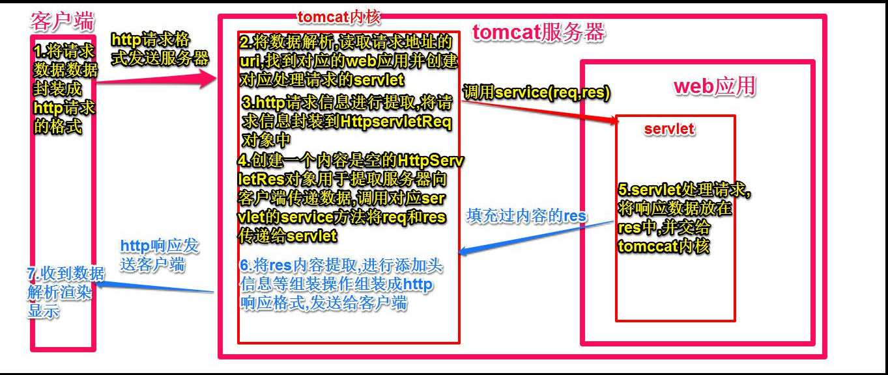

# Servlet

Servlet是运行在服务端的Java小程序,是sun公司提供一套规范(接口),用来处理客户端请求、响应给浏览器的动态资源。servlet的实质就是java代码,通过java的API 动态的向客户端输出内容

## Servlet的内部实现原理

- servlet规范:包含三个技术点:servlet技术,filter(过滤器)技术,listener(监听器)技术
- 当客户端发送过来一个请求的时候,tomcat会先解析请求的路径,在web.xml的配置文件中去找到对应匹配的路径,如果找到,就会通过配置文件中servlet­name找到对应的类,然后去创建对应类的对象,此时因为接口规范中规定了,init方法,所以tomcat会去调用相应对象的init方法,然后再去调用service方法,由我们service方法去处理响应的请求



## Servlet生命周期

- init方法: servlet创建的时候执行
- service方法: 每次发送请求的时候执行  
  - `ServletRequest`代表请求 认为 `ServletRequest` 内部封装的是http请求的信息
  - `ServletResponse`代表响应 认为要封装的是响应的信息
- destory方法: 服务器关闭的时候执行

## Servlet的配置
当我们创建了类并且实现了Servlet接口,需要告知tomcat当有对应请求的时候创建我们的Servlet对象,并调用相应的init,service,destory方法,那么就需要在web.xml中配置相关的Servlet信息

- `<servlet>` 中的 `<servlet-name>` 中的名字可以任意起,但是需要和 `<servlet-mapping>` 中的 `<servlet-name>` 相同
 - `<servlet>` 中的 `<servlet-class>` 指定是对应servlet的类的全名, `<servlet-mapping>` 中`<url-pattern>` 指的是当浏览器中输入什么路径的时候去匹配我们对应的servlet
```html
<servlet>
  <servlet-name>he</servlet-name>
  <servlet-class>test.HelloServelt</servlet-class>
</servlet>
<servlet-mapping>
  <servlet-name>he</servlet-name>
  <url-pattern>/hello</url-pattern>
</servlet-mapping>
```

- url­pattern的配置方式
  - 完全匹配如 `/myServlet`
  - 目录匹配如 `/a/b/c/*`
  - 扩展名匹配 `*.do`
  - 缺省配置如 `/`当你访问资源地址所有的servlet都不匹配时,缺省的servlet负责处理. 其实,web应用中所有的资源的响应都是servlet负责,包括静态资源,对于静态资源其实是由tomcat的默认servlet进行处理的
  - `/`和`/*`区别: `/`不会处理后缀名是`.jsp`的资源 `/*`会处理后缀名是`.jsp`的资源
- 启动服务器的时候创建servlet配置 `<load-on-startup>1</load-on-startup>` 只要不是负数都会随着服务器的启动而创建,值越小优先级越高  
```html
<servlet>
  <servlet-name>he</servlet-name>
  <servlet-class>test.HelloServelt</servlet-class>
  <load-on-startup>1</load-on-startup>
 </servlet>
 <servlet-mapping>
  <servlet-name>he</servlet-name>
  <url-pattern>/hello</url-pattern>
 </servlet-mapping>
```

- 欢迎界面
```html
<welcome-file-list>
  <welcome-file>index.html</welcome-file>
  <welcome-file>index.htm</welcome-file>
  <welcome-file>index.jsp</welcome-file>
  <welcome-file>default.html</welcome-file>
  <welcome-file>default.htm</welcome-file>
  <welcome-file>default.jsp</welcome-file>
</welcome-file-list>
```