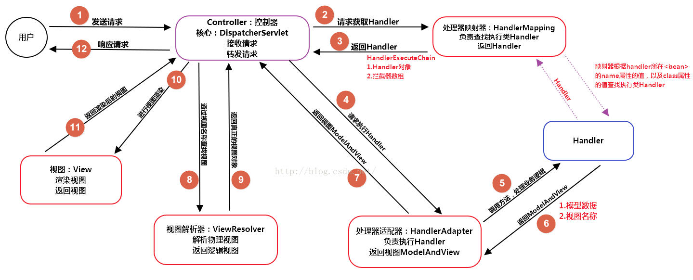
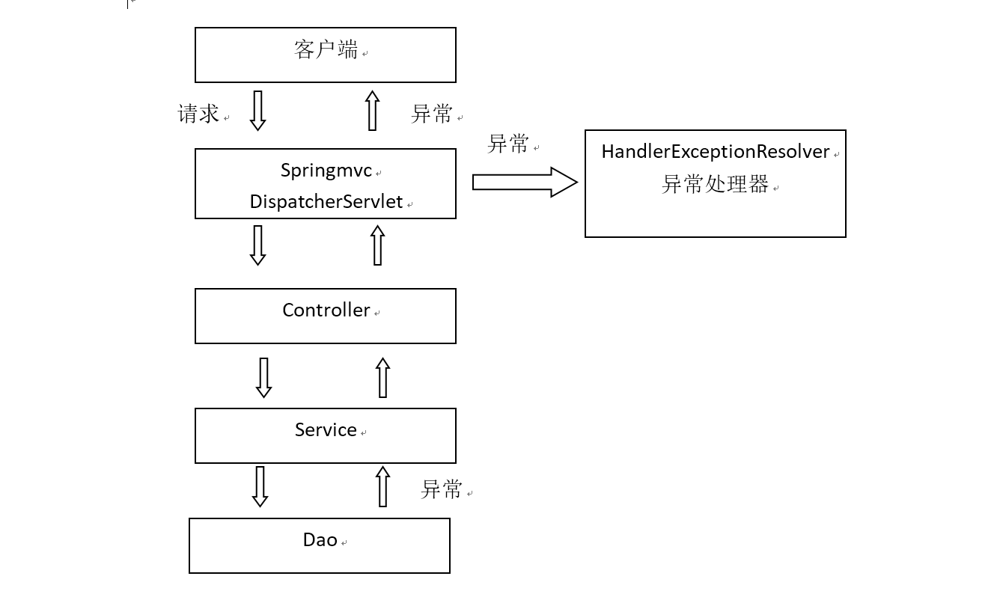

# SpringMVC

Spring框架的web层的框架

## 开发流程
- 导包
  - beans+context+core+expression
  - aop+web+webmvc+jstl+commons.logging
- 设置springmvc的约束文件
- 创建配置文件springmvc.xml,配置扫描controller.web包
```html
<context:component-scan base-package="test.springmvc.web"/>
```
- 配置`web.xml`文件
  - 配置前端控制器和 `servlet` 的初始化参数为 `springmvc` 配置文件的路径
  - 和Spring相同 `param-name` 为 `contextConfigLocation` ,这个初始化参数指的是servlet的初始化参数(如果不配置路径,springmvc会默认去找 `/WEB-INF/servlet名字-servlet.xml` 此文件,如果没有此文件就会报异常)
```html
<servlet>
    <servlet-name>DispatcherServlet</servlet-name>
    <servlet-class>org.springframework.web.servlet.DispatcherServlet</servlet-class>
    <!-- SpringMVC的配置文件的默认路径是/WEB-INF/servlet名字-servlet.xml -->
    <init-param>
        <param-name>contextConfigLocation</param-name>
        <param-value>classpath:springmvc.xml</param-value>
    </init-param>
</servlet>
<servlet-mapping>
    <servlet-name>DispatcherServlet</servlet-name>
    <url-pattern>*.action</url-pattern>
</servlet-mapping>
```
- 创建一个包叫做 `controller` 就是web层
  - 创建类,用来处理请求,使用注解的形式将其配置到spring容器中,在其中创建方法处理请求
```java
@Controller
public class RoleController {
	@RequestMapping("/role/roleList.action")
	public ModelAndView roleList(){
		ModelAndView mv = new ModelAndView();
		//向域中放数据
		//内部原理就是将数据放入request域
		mv.addObject("a", "123");
		mv.setViewName("/a.jsp");
		return mv;
	}
}
 ```

## springmvc架构



1. 用户向服务器发送请求,请求被Spring 前端控制`Servelt DispatcherServlet`捕获
2. `DispatcherServlet`对请求URL进行解析,得到请求资源标识符(URI)。然后根据该URI,调用`HandlerMapping`获得该`Handler`配置的所有相关的对象(包括Handler对象以及Handler对象对应的拦截器),最后以`HandlerExecutionChain`对象的形式返回
3. `DispatcherServlet `根据获得的`Handler`,选择一个合适的`HandlerAdapter`。(附注:如果成功获得`HandlerAdapter`后,此时将开始执行拦截器的`preHandler(...)`方法)
4. 提取`Request`中的模型数据,填充`Handler`入参,开始执行`Handler(Controller)`。 在填充`Handler`的入参过程中,根据你的配置,`Spring`将帮你做一些额外的工作:
    1. `HttpMessageConveter`: 将请求消息(如Json、xml等数据)转换成一个对象,将对象转换为指定的响应信息
    2. 数据转换:对请求消息进行数据转换。如String转换成Integer、Double
    3. 数据根式化:对请求消息进行数据格式化。 如将字符串转换成格式化数字或格式化日期等
    4. 数据验证: 验证数据的有效性(长度、格式等),验证结果存储到BindingResult或Error中
5. `Handler`执行完成后,向`DispatcherServlet` 返回一个`ModelAndView`对象, 其中view是视图名称，不是真正的视图对象
6. 根据返回的`ModelAndView`,选择一个适合的`ViewResolver`(必须是已经注册到Spring容器中的ViewResolver)进行视图的解析
7. `ViewReslover`解析后返回真正的视图对象 `View）`
8. `DispatcherServlet`对View进行渲染视图(即将模型数据填充至视图中)
9. `DispatcherServlet`响应用户

## springmvc组件介绍及配置

### DispatcherServlet:前端控制器

- 用户请求到达前端控制器,它就相当于mvc模式中的c
- dispatcherServlet是整个流程控制的中心,由它调用其它组件处理用户的请求
- dispatcherServlet的存在降低了组件之间的耦合性。

### HandlerMapping:处理器映射器

- HandlerMapping负责根据用户请求url找到Handler即处理器
- springmvc提供了不同的映射器实现不同的映射方式,例如:配置文件方式,实现接口方式,注解方式等
- 在controller中对应的方法使用的@RequestMapping 就是注解的方式配置,是目前使用最多的配置方式.

### Handler:处理器

- Handler 是继DispatcherServlet前端控制器的后端控制器,在DispatcherServlet的控制下Handler对具体的用户请求进行处理。
- 由于Handler涉及到具体的用户业务请求,所以一般情况需要程序员根据业务需求开发Handler。

### HandlAdapter:处理器适配器

通过HandlerAdapter对处理器进行执行,这是适配器模式的应用,通过扩展适配器可以对更多类型的处理器进行执行。

### ViewResolver:视图解析器

View Resolver负责将处理结果生成View视图,View Resolver首先根据逻辑视图名解析成物理视图名即具体的页面地址,再生成View视图对象,最后对View进行渲染将处理结果通过页面展示给用户。

### View:视图
springmvc框架提供了很多的View视图类型的支持,包括:jstlView、freemarkerView、pdfView等。我们最常用的视图就是jsp。

### 说明

在springmvc的各个组件中,处理器映射器、处理器适配器、视图解析器称为springmvc的三大组件。

可以认为是 **一个中心三个基本点** ,需要用户开发的组件有handler、view

- 配置相关组件
  - 通过观察发现默认的处理器适配器和处理器映射器,在3.2后就推荐使用新的配置,所以我们要重新去配置新的处理器映射器和处理器适配器
  - 在springmvc的配置文件中需要将新的处理器映射器和处理器适配器配置如容器中
```html
<!-- 配置处理器映射器 -->
<bean class="org.springframework.web.servlet.mvc.method.annotation.RequestMappingHandlerMapping" />
<!-- 配置处理器适配器 -->
<bean class="org.springframework.web.servlet.mvc.method.annotation.RequestMappingHandlerAdapter" />
```
- 注解驱动
 - SpringMVC使用 `<mvc:annotation-driven>`自动加载`RequestMappingHandlerMapping`和`RequestMappingHandlerAdapter`
```html
<!-- 自动加载处理器映射器和处理器适配器 -->
<mvc:annotation-driven />
```

#### 视图解析器

通过配置视图解析器的前缀和后缀在前端控制器将`modelAndView`交给视图解析器的时候,自动会视图的路径添加前缀和后缀

```html
<bean class="org.springframework.web.servlet.view.InternalResourceViewResolver">
    <property name="prefix" value="/WEB-INF/view/"></property>
    <property name="suffix" value=".jsp"></property>
</bean>
```

如果前缀存在两个/的话会删去一个

### 静态资源放行

前端控制器的本质是一个`servlet`, 所以 `url-pattern` 符合servlet的规则,但是springmvc是需要拦截请求才能使用框架进行处理

- 后缀名进行匹配(推荐使用这种方式): 不需要设置静态资源放行
-  `/*` 会对jsp进行拦截的,所以一般不使用 /*
- ` /` 也会对静态资源进行拦截,需要设置静态资源放行

#### 静态资源放行方式一

tomcat内部有一个叫做默认`servlet`的 `url-pattern`为 `/` 其可以处理静态资源,我们可以在配置文件中配置一个默认的servlet为这个,当所有路径都不匹配的时候让这个servlet进行处理,必须要配置注解驱动才能正常使用
```html
<mvc:default-servlet-handler/>
```

#### 静态资源放行方式二

手动建立映射关系, `/**` 表示可以有下一级文件夹,这种映射路径的方法,内部是由处理器映射器去执行具体的映射过程,所以必须要配置注解驱动如果不配置注解驱动会导致web应用无法访问,此方法的好处是路径可以直接在配置文件中进行指定
```html
<mvc:resources location="/image/" mapping="/image/**"/>
<mvc:resources location="/css/" mapping="/css/**"/>
<mvc:resources location="/js/" mapping="/js/**"/>
<mvc:resources location="/lib/" mapping="/lib/**"/>
```

## 参数绑定

如果我们定义了请求,响应,session,springmvc就会将`HttpServletRequest`,`HttpServletResponse`,`HttpSession`三个对象作为参数传递过来,我们在定义参数的时候还可以写`Model`,`ModelMap`用来向页面进行传值使用的,这两个哪一个都可以

### 简单类型参数

参数类型推荐使用包装数据类型,因为基础数据类型不可以为null

- 整形:Integer、int
- 字符串:String
- 单精度:Float、float
- 双精度:Double、double
- 布尔型:Boolean、boolean (,请求的参数值为true或false。或者1或0)

### @RequestParam

如果表单中的name属性和参数名称不一致的时候可以使用 `@RequestParam` 建立映射关系,一旦使用了这个注解,传递的参数就必须含有改名称如果没有名称,就会报错误

- `required`属性表示页面传过来的值是否是必须的,默认是true
- `defaultValue`表示如果没有该值默认是多少

```java
public ModelAndView userList(@RequestParam(value="id", required=false, defaultValue="1") Integer tid) {
}
```

### 参数绑定model类

需保证表单的name属性和model中的属性一一对应

```java
public ModelAndView userList(User u) {
}
```
### 在web.xml中配置编码过滤器

```html
<filter>
    <filter-name>CharacterEncoding</filter-name>
    <filter-class>org.springframework.web.filter.CharacterEncodingFilter</filter-class>
    <init-param>
        <param-name>encoding</param-name>
        <param-value>UTF-8</param-value>
    </init-param>
</filter>
<filter-mapping>
    <filter-name>CharacterEncoding</filter-name>
    <url-pattern>*.action</url-pattern>
</filter-mapping>
```

### 参数绑定包装类

如果是包装类中的属性,需要将表单信息中的name属性名设置为类中属性的属性

```java
@RequestMapping("/role/editRole.action")
public ModelAndView editRole(RoleVO vo){
    rs.updateRole(vo.getR());
    ModelAndView mv = new ModelAndView();
    mv.setViewName("success");
return mv;
}
```

```java
public class RoleVO {
    private Role r;
    set()...
    get()...
}
```

### 数组参数绑定

在表单如果有checkbox这种多选框,提交到controller,可以通过数组的形式进行获取,那么需要将checkbox的name属性设置为方法的参数的名称,也可以在包装类中定义成员变量的名字为表单中的name属性值

### 集合类型参数绑定

在表单中如果牵扯到表格中的数据批量修改,并且每一行有多个数据都要更改且有多行,我们可以把每一行当作一个对象,把多行数据放入对象集合中进行提交,不过这种方法仅仅适合于包装类,不能直接把值传入相应的参数

### 自定义格式类型转换(了解即可)

可以进行日期的转换,以及数据的相应格式化(比如将表单提交的数据加前后缀)

springmvc给我们提供一个转换器工程,我们可以通过
这个转换器工程生产很多转换类(实现Convert接口)按
照我们的要求进行数据的格式转换,对方法参数赋值的
事情是处理器适配器做的,所以配置的工作应该交给处
理器适配器,而在springmvc中我们已经通过注解配置
了这个组件,所以配置应该在 `<mvc:annotation-driven/>` 进行设置

- 在springmvc的配置文件中,配置一个转换器工厂的bean
```html
<mvc:annotation-driven conversion-service="conversionService"/>
<bean name="conversionService" class="org.springframework.format.support.FormattingConversionServiceFactoryBean">
    <property name="converters">
    <set>
        <bean class="test.ssm.util.DateConvert"/>
    </set>
    </property>
</bean>
```

```java
//Converter<S, T>
//S:source,需要转换的源的类型
//T:target,需要转换的目标类型
public class DateConvert implements Converter<String, Timestamp>{
    @Override
    public Timestamp convert(String str) {
        //2017+07_27 12:06:50.0
        DateFormat df = new SimpleDateFormat("yyyy+MM+dd HH:mm:ss");
        Timestamp t = null;
        try {
            t = new Timestamp(df.parse(str).getTime());
        } catch (ParseException e) {
            e.printStackTrace();
        }
        return t;
    }
}
```

### 日期格式化

对于日期格式,我们可以直接通过注解的形式对POJO的成员变量直接进行日期的格式化

```java
@DateTimeFormat(pattern="yyyy-MM-dd'T'HH:mm")
private Date rUpdatetime;
```

```html
<tr>
    <td>修改日期</td>
    <td colspan="3" class="control">
        <input type="datetime-local" name="r.rUpdatetime" value='<fmt:formatDate value="${role.rUpdatetime}" type="both" pattern="yyyy-MM-dd'T'hh:mm:ss"/>' placeholder="修改日期">
    </td>
</tr>
```

```java
@RequestMapping("/role/editRole.action")
public ModelAndView editRole(RoleVO re){
    System.out.println(re);
    rs.updateRole(re.getR());
    ModelAndView mv = new ModelAndView();
    mv.setViewName("success");
    return mv;
}
```

### 多个路径匹配

value属性是数组,可以同时匹配多个映射路径

```java
@RequestMapping("/department/list.action", "/")
```

### 简化路径

@RequestMapping配置在类的上方,以下所有的方法都可以省去前面的那个路径

```java
@Controller
@RequestMapping("/role")
public class RoleController {
    @RequestMapping("/list.action")
	public String RoleList(Model md) {
    }
}
```

### 限定请求方法

以通过`@RequestMapping`限定是GET请求还是POST请求,使用其`method`属性(是数组,也就是可以同
时设置多个方式),属性类型是 `RequestMethod(枚举类型)`

```java
@RequestMapping(value="/update.action", method={RequestMethod.POST, RequestMethod.GET})
public String updateRole(Role r) {
}
```

页面405错误表示没有对应请求的post或get方法,如果出现该错误,首先排查此项

## cotroller方法的返回值

### ModelAndView

- 返回数据和页面,其内部的原理是数据放在request域中,页面通过内部转发得到
- 使用对象的 `addObject` 添加数据
- 使用` setViewName` 设置视图

```java
	@RequestMapping("/role/roleList.action")
	public ModelAndView roleList(){
		
		ModelAndView mv = new ModelAndView();
		//向域中放数据
		//内部原理就是将数据放入request域
		mv.addObject("a", "123");
		mv.setViewName("/a");
		return mv;
	}
```

### void返回值

如果要进行页面跳转,需要使用参数中的`request`和`response`

```java
@RequestMapping("/department/update.action")
public void updateDepartmentT(HttpServletRequest request, HttpServletResponse response) {
    request.getRequestDispatcher("/WEB-INF/jsp/success.jsp").forward(request,response);
    response.sendRedirect(req.getContextPath()+"/role/roleList.action");
}
```

void的主要用于ajax请求,因为ajax只需要返回数据,不需要返回视图

### String返回值

使用参数中的`model`或者`modelMap`进行数据的填充

企业开发中推荐使用这种方法,因为模型和视图被分开,程序被解耦

- 返回值是视图名称
```java
@RequestMapping("/list.action")
public String RoleList(Model md) {
    List<Role> list = rs.findAllRole();
    md.addAttribute("list", list);
    return "role/list";
```
- 内部转发: 相当于执行了request的内部转发的操作,model中的数据存在,相当于一次请求,
```java
 return "forward:/role/list.action";
```
- 重定向: 不需要添加web应用的名称
```java
return "redirect:/role/list.action";
//携带参数
return "redirect:/role/list.action?id="+id;
```

#### 注意问题

- 直接写字符串，那么这个字符串就算视图，会添加前缀和后缀，跳转方式为内部转发
- forward: 不会添加前缀和后缀,跳转方式为内部转发，路径格式和原生一样
- redirect: 不会添加前缀和后缀， 跳转方式为重定向， 路径不需要添加web应用名称
- 如果是重定向的话model中的数据是不能使用的,因为model中的数据是保存在request域中


## 全局异常处理器

系统中异常包括两类:预期异常和运行时异常`RuntimeException`,前者通过捕获异常从而获取异常信息,后者主要通过规范代码开发、测试通过手段减少运行时异常的发生。

系统的dao、service、controller出现都通过`throwsException`向上抛出,最后由`springmvc`前端控制器交由异常处理器进行异常处理




写一个类实现异常处理器接口HandlerExceptionResolver,然后将此实现类配置到springmvc的配置文件中,
收到异常的时候让web程序跳转到一个异常界面, 并把异常信息进行打印

```java
public class MyHandlerException implements HandlerExceptionResolver {

	@Override
	public ModelAndView resolveException(HttpServletRequest req, HttpServletResponse res, Object obj, Exception exception) {
		
		ModelAndView mav = new ModelAndView();
		
		mav.addObject("obj",obj);
		mav.addObject("error",exception);
		
		mav.setViewName("forward:/error.jsp");
		
		return mav;
	}

}
```

```html
<bean class="test.ssm.util.CustomHandlerException"/>
```

## Springmvc图片上传

- 导包,添加 `commons-io` 和 `commons-fileuplod` 
- 在jsp页面中把需要进行上传图片的form表单添加属性 `enctype="multipart/form-data"` ,否则无法提交图片,添加`input` 类型为`file`
- 在controller的参数位置写为` MultipartFile pic`, `MultipartFile` 是文件类型,
- `MultipartFile`是接口,需要`springmvc`帮助我们创建实现类,所以在配置文件中配置`CommonsMultipartResolver` 这个类, 就是 `MultipartFile` 的实现类,名字只能是 `multipartResolver` ,因为`springmvc`会通过这个名字找到这个文件上传解析器
- 我们也可以通过这个解析器设置最大支持文件的大小, 单位是B
```html
<bean id="multipartResolver" class="org.springframework.web.multipart.commons.CommonsMultipartResolver">
    <property name="maxUploadSize" value="#{6*1024*1024}"></property>
</bean>
```

```java
@RequestMapping(value="/fileupload.action", method=RequestMethod.POST )
public String FileUpload(String name, MultipartFile picFile, HttpServletRequest req) throws IllegalStateException, IOException {

    //获取原始文件名
    String ss = picFile.getOriginalFilename();

	//获取原始文件的后缀名
    String ext = FilenameUtils.getExtension(picFile.getOriginalFilename());

    //获取随机UUID
    String st = UUID.randomUUID().toString().replaceAll("-", ""); 

    //获取原始文件的真实位置
    String path = req.getRealPath(req.getContextPath());

    //存放文件
    picFile.transferTo(new File("/home/siyu/图片/java/"+fileName));

    return "redirect:/role/list.action";
}
```

- 在tomcat中创建一个虚拟目录,进行文件的存放文件,这样就不会在服务器重新部署的时候清空文件

## springmvc的拦截器

Spring Web MVC 的处理器拦截器类似于Servlet 开发中的过滤器Filter,用于对处理器进行预处理和后处理。

- 创建拦截器类实现 `HandlerInterceptor` 接口,接口中定义了三个方法
  - `preHandle`: 预处理回调方法,实现处理器的预处理(如登录检查),第三个参数为响应的处理器
    - 返回值true表示继续流程(如调用下一个拦截器或处理器)
    - 返回值false表示流程中断(如登录检查失败),不会继续调用其他的拦截器或处理器,此时我们需要通过response来产生响应;
  - `postHandle`: 后处理回调方法,实现处理器的后处理(但在渲染视图之前),此时我们可以通过modelAndView(模型和视图对象)对模型数据进行处理或对视图进行处理,modelAndView也可能为null。
  - `afterCompletion`: 视图渲染显示后调用,可查看日志,清理一些资源

```java
public class MyInterceptor implements HandlerInterceptor {

	@Override
	public void afterCompletion(HttpServletRequest arg0, HttpServletResponse arg1, Object arg2, Exception arg3) throws Exception {
		System.out.println("视图渲染显示后调用,可查看日志,清理一些资源");
	}

	@Override
	public void postHandle(HttpServletRequest arg0, HttpServletResponse arg1, Object arg2, ModelAndView arg3) throws Exception {
		System.out.println("controller执行后调用,参数是req和res,controller对象和数据视图,可以对数据进行处理");
	}

	@Override
	public boolean preHandle(HttpServletRequest req, HttpServletResponse res, Object arg2) throws Exception {
		
        //判断是否已经登陆
		HttpSession session = req.getSession();
		User u = (User) session.getAttribute("LOGIN_USER");
		if (u == null) {
			res.sendRedirect(req.getContextPath()+"/index.jsp");
			return false;
		} else {
			return true;
		}
		
	}

}
```

```html

<mvc:interceptors>
    <mvc:interceptor>
        <!--拦截所有请求,会将静态资源也拦截 -->
        <mvc:mapping path="/**"/>
        <!-- 放行拦截 -->
        <mvc:exclude-mapping path="/index.jsp"/>
        <mvc:exclude-mapping path="/user/login.action"/>
        <mvc:exclude-mapping path="/css/**"/>
        <mvc:exclude-mapping path="/image/**"/>
        <mvc:exclude-mapping path="/js/**"/>
        <mvc:exclude-mapping path="/lib/**"/>
        <bean class="com.bd19.exam.interceptor.MyInterceptor"></bean>
    </mvc:interceptor>
</mvc:interceptors>
```